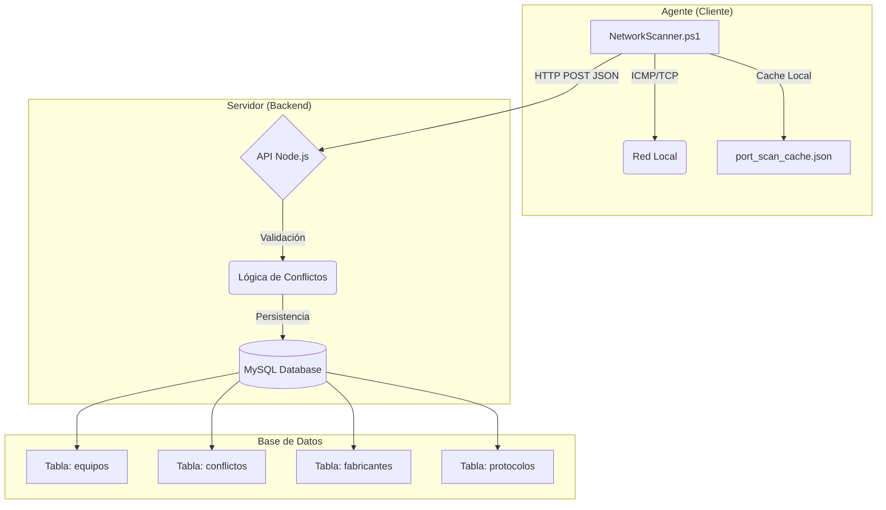

# Escáner de Red y Monitor de Conflictos

Sistema integral de monitoreo de red que combina un potente agente de escaneo en PowerShell con un backend en Node.js para detectar dispositivos, identificar fabricantes y alertar sobre conflictos de IP/MAC en tiempo real.

## 🚀 Características Principales

*   **Escaneo Inteligente**: Agente PowerShell optimizado con ejecución en paralelo y caché de puertos (TTL 10 min) para reducir el tráfico de red.
*   **Detección Híbrida**: Identificación de Sistema Operativo mediante WMI (Windows Domain) y análisis de TTL (Time-To-Live).
*   **Validación de Conflictos**: El backend detecta automáticamente:
    *   **IP Duplicada**: Misma IP en diferentes Hostnames/MACs.
    *   **MAC Duplicada**: Misma MAC en diferentes Hostnames.
*   **Base de Datos de Fabricantes**: Identificación automática de fabricantes usando una base de datos local con más de **38,000 registros OUI** oficiales del IEEE.
*   **Historial de Protocolos**: Registro detallado de puertos y servicios abiertos por dispositivo.

## 🏗️ Arquitectura



## 🛠️ Requisitos del Sistema

*   **Agente**: Windows con PowerShell 5.1 o superior (Recomendado PowerShell 7+).
*   **Backend**: Node.js v14+.
*   **Base de Datos**: MySQL 8.0+.

## 📦 Guía de Instalación y Despliegue

Sigue estos pasos para desplegar el sistema completo en un nuevo entorno.

### 1. Configuración de Base de Datos

1.  Asegúrate de tener MySQL corriendo y crea una base de datos (ej. `escaner_red`).
2.  Navega al directorio `database`:
    ```bash
    cd database
    npm install
    ```
3.  Crea un archivo `.env` en la raíz del proyecto con tus credenciales (ver `.env.example`).
4.  Inicializa las tablas:
    ```bash
    npm run init-db
    ```
5.  (Opcional) Poblar la base de datos de fabricantes (descarga ~4MB de datos IEEE):
    ```bash
    npm run seed-oui
    ```

### 2. Configuración del Backend (Servidor)

1.  Navega al directorio `server`:
    ```bash
    cd server
    npm install
    ```
2.  Inicia el servidor:
    ```bash
    # Modo producción
    npm start
    
    # Modo desarrollo
    npm run dev
    ```
    *El servidor escuchará por defecto en el puerto 3000.*

### 3. Ejecución del Agente (Escáner)

1.  Abre el script `agent/NetworkScanner.ps1`.
2.  Verifica la configuración en la sección superior:
    ```powershell
    $SubnetPrefix = "192.168.1."       # Tu subred
    $ApiUrl = "http://localhost:3000/api/scan-results" # URL del backend
    ```
3.  Ejecuta el script:
    ```powershell
    .\NetworkScanner.ps1
    ```

## ⚙️ Configuración

### Variables de Entorno (.env)
Ubicado en la raíz del proyecto:

```env
DB_HOST=localhost
DB_PORT=3306
DB_USER=usuario
DB_PASSWORD=contraseña
DB_NAME=escaner_red
PORT=3000 # Puerto del servidor backend
```

### Configuración del Agente (PowerShell)
Variables modificables en `NetworkScanner.ps1`:

*   `$SubnetPrefix`: Prefijo de la red a escanear (ej. "10.0.0.").
*   `$PingCount`: Número de pings por host.
*   `$PortScanEnabled`: `$true` para escanear puertos.
*   `$PortCacheTTLMinutes`: Tiempo de vida del caché de puertos (default: 10).
*   `$EnableApiExport`: `$true` para enviar datos al backend.

## 🚨 Solución de Problemas常见

*   **Error de ejecución de scripts en PowerShell**:
    Ejecuta `Set-ExecutionPolicy RemoteSigned -Scope CurrentUser` para permitir scripts locales.
*   **Error de conexión a MySQL**:
    Verifica que el usuario tenga permisos y que el archivo `.env` esté en la raíz del proyecto.
*   **El escáner es lento**:
    Asegúrate de usar PowerShell 7+ para aprovechar el paralelismo (`ForEach-Object -Parallel`).

## 🤝 Contribución

1.  Fork del repositorio.
2.  Crea tu rama (`git checkout -b feature/AmazingFeature`).
3.  Commit de tus cambios (`git commit -m 'Add some AmazingFeature'`).
4.  Push a la rama (`git push origin feature/AmazingFeature`).
5.  Abre un Pull Request.

## 📄 Licencia

Distribuido bajo la licencia MIT. Ver `LICENSE` para más información.
