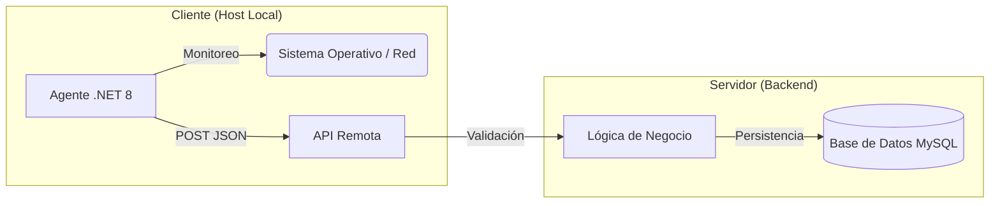

# Monitor de Actividad de Protocolos de Red

**Versión Actual:** v0.3.0

## 📋 Información General

El **Monitor de Actividad de Protocolos de Red** es un sistema integral diseñado para la recolección, análisis y visualización de métricas de red y actividad de puertos en entornos locales. Desarrollado bajo un contexto académico, este proyecto tiene como propósito demostrar la arquitectura de sistemas distribuidos mediante la implementación de un agente de monitoreo y un servidor centralizado de procesamiento.

El sistema permite identificar la actividad de red del host, incluyendo puertos TCP/UDP activos, direcciones IP, y metadatos del sistema operativo, facilitando el análisis de comportamiento de red en tiempo real.

## 🚧 Estado del Proyecto

> **Estado:** v0.3.0 (Estable - Desarrollo Activo)

El proyecto ha alcanzado la versión **v0.3.0**, completando todas las milestones definidas para esta etapa. El sistema es totalmente funcional, estable y demostrable. Sin embargo, se mantiene en la rama de versiones `0.x` para reflejar que continúa en desarrollo activo, con mejoras arquitectónicas y funcionales planificadas para futuras iteraciones.

**¿Qué significa v0.3.0?**
- El núcleo del sistema (agente, API, base de datos) es sólido.
- La funcionalidad principal de escaneo y reporte está operativa.
- No se considera un producto final comercial, sino una implementación académica robusta.

## 🏗️ Arquitectura General

El sistema sigue una arquitectura **Cliente-Servidor** desacoplada, donde el agente recolector opera independientemente del sistema de procesamiento y almacenamiento.

### Flujo de Datos

1.  **Recolección**: El Agente (.NET Service) escanea el host local.
2.  **Transmisión**: Los datos se envían vía HTTP POST a la API REST.
3.  **Procesamiento**: El Backend recibe, valida y clasifica la información.
4.  **Persistencia**: Los datos procesados se almacenan en una base de datos relacional.

## 🧩 Componentes del Sistema

### 1. Cliente (Agente de Monitoreo)
El componente cliente es un servicio de fondo desarrollado en **.NET 8**, diseñado para ser eficiente y poco intrusivo.

*   **Tecnología**: .NET 8 (C#).
*   **Ejecución**: Servicio de Windows (Windows Service).
*   **Despliegue**: Compilado como *Self-Contained* (no requiere instalar el runtime de .NET manualmente en el host destino si se usa el instalador completo).
*   **Alcance**: Escaneo estrictamente limitado al **Localhost** (127.0.0.1 / ::1) y la interfaz de red local. No realiza escaneos, barridos de red externa ni fuerza bruta.
*   **Datos Recolectados**:
    *   Direcciones IP y configuración de interfaz.
    *   Hostname y detalles del Sistema Operativo.
    *   Dirección MAC.
    *   Estado de puertos TCP y UDP (activos/inactivos).
    *   Timestamps e historial de conexión.

### 2. Backend / API
El servidor actúa como el punto central de verdad, exponiendo endpoints REST para la recepción de datos.

*   **Responsabilidad**: Recibir los payloads JSON del agente.
*   **Procesamiento**: Clasifica los puertos detectados (conocidos vs. desconocidos) y actualiza el estado de los protocolos.
*   **Separación**: Mantiene la lógica de negocio aislada del cliente, permitiendo actualizar las reglas de clasificación sin modificar los agentes instalados.

### 3. Base de Datos
El sistema utiliza un modelo relacional robusto para garantizar la integridad de los datos históricos.

*   **Enfoque**: Integridad referencial y normalización.
*   **Modelo**: Relacional (MySQL/MariaDB).
*   **Almacenamiento**: Mantiene un registro histórico de puertos abiertos, permitiendo auditoría y análisis de tendencias sobre qué servicios se ejecutan en el host a lo largo del tiempo.

## 📚 Documentación

La documentación del proyecto ha sido actualizada para la versión v0.3.0:

*   📖 **[Manual de Usuario](docs/manual_usuario.md)**: Guía para la instalación, configuración y uso básico del sistema.
*   ⚙️ **[Manual Técnico](docs/manual_tecnico.md)**: Detalles profundos sobre la estructura del código, endpoints de la API y esquema de base de datos.

## 🔖 Versionado

Este proyecto se adhiere a [Semantic Versioning 2.0.0](https://semver.org/).

*   **Versión actual (0.3.0)**: Indica un incremento en funcionalidad menor (minor) compatible hacia atrás, manteniendo el "major" en 0 para denotar la fase de desarrollo inicial y académica.

## ⚖️ Consideraciones Legales y de Uso

*   **Uso Académico**: Este software ha sido desarrollado con fines estrictamente educativos y de demostración tecnológica.
*   **Alcance del Escaneo**: El agente está programado para monitorear únicamente el dispositivo donde está instalado (Localhost). No está diseñado ni autorizado para auditar redes de terceros, realizar *pentesting* ni actividades de intrusión.
*   **Responsabilidad**: El usuario es responsable de asegurar que tiene los permisos necesarios para instalar y ejecutar servicios de monitoreo en el equipo anfitrión.

## 🗺️ Roadmap

Aunque el proyecto cumple sus objetivos actuales, algunas áreas de mejora potencial incluyen:

*   Implementación de autenticación segura (JWT) para la comunicación Agente-API.
*   Dashboard web interactivo para visualización de estadísticas.
*   Alertas en tiempo real para detección de puertos no autorizados.
*   Soporte multiplataforma (Linux/macOS) para el agente .NET.

---
© 2026 - Proyecto Universitario - Monitor de Actividad de Protocolos de Red
