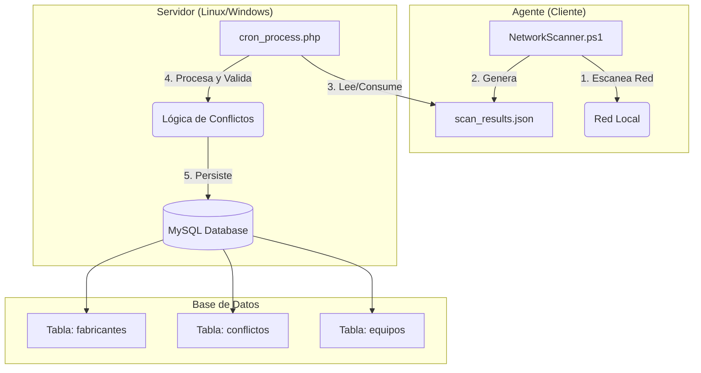

# Escáner de Red y Monitor de Conflictos

Sistema integral de monitoreo de red que combina un potente agente de escaneo en PowerShell con un backend en **PHP** para detectar dispositivos, identificar fabricantes y alertar sobre conflictos de IP/MAC en tiempo real.

### 🖥️ Aplicación de Bandeja (System Tray)

La solución incluye una aplicación gráfica (`NetworkScannerUI`) que se ejecuta en la bandeja del sistema para monitorear el servicio.

**Características:**
- Icono en el área de notificaciones
- Menú contextual para Iniciar/Detener el servicio
- Acceso rápido a los Logs
- Indicador visual de estado

**Instalación (Auto-arranque):**
Para que la UI inicie automáticamente con Windows:
1. Copia el ejecutable `NetworkScannerUI.exe` a una ruta permanente.
2. Crea un acceso directo en `shell:startup` O agrega una clave de registro en:
   `HKCU\Software\Microsoft\Windows\CurrentVersion\Run`
   Nombre: `NetworkScannerUI`
   Valor: `"C:\Ruta\A\NetworkScannerUI.exe"`

## 🚀 Características Principales

*   **Escaneo Inteligente**: Agente PowerShell optimizado con ejecución en paralelo y caché de puertos.
*   **Detección Híbrida**: Identificación de Sistema Operativo mediante WMI (Windows Domain) y análisis de TTL.
*   **Backend PHP Eficiente**: Procesamiento asíncrono mediante scripts programados (Cron/Task Scheduler) o API REST.
*   **Validación de Conflictos**: Detecta automáticamente:
    *   **IP Duplicada**: Misma IP en diferentes Hostnames/MACs.
    *   **MAC Duplicada**: Misma MAC en diferentes Hostnames.
*   **Base de Datos de Fabricantes**: Identificación automática usando seeders locales (OUI IEEE).

## 🏗️ Arquitectura y Flujo de Datos

El sistema funciona desacoplando el escaneo (Agente) del procesamiento (Servidor).



1.  **Agente**: Ejecuta el escaneo y deposita los resultados en un archivo JSON en una ruta compartida o accesible por el servidor.
2.  **Cron Process**: Un script PHP programado (`cron_process.php`) verifica periódicamente si hay nuevos archivos de resultados, los procesa e inserta en la base de datos, moviendo el archivo procesado al finalizar.

## 🛠️ Requisitos del Sistema

*   **Agente**:
    *   Windows con PowerShell 5.1+ (Recomendado PowerShell 7+ para paralelismo).
    *   (Opcional) Linux con PowerShell Core instalado.
*   **Backend (Servidor)**:
    *   PHP 7.4 o superior.
    *   Extensiones PHP: `php-pdo`, `php-mysql`, `php-json`.
*   **Base de Datos**:
    *   MySQL 8.0 o MariaDB equivalente.

## 📦 Guía de Instalación y Configuración

### 1. Configuración de Base de Datos y Entorno

1.  **Crear Base de Datos**:
    Crea una base de datos vacía en MySQL (ej. `escaner_red`).

2.  **Configurar Variables de Entorno (.env)**:
    En la raíz del proyecto, crea un archivo `.env` basado en el siguiente ejemplo. **Es crucial para enlazar la base de datos**.

    ```ini
    # .env
    DB_HOST=localhost
    DB_PORT=3306
    DB_USER=tu_usuario
    DB_PASSWORD=tu_contraseña
    DB_NAME=escaner_red
    ```

3.  **Inicializar Esquema y Datos**:
    Ejecuta el script de inicialización PHP desde la carpeta root o `database`:
    
    ```bash
    php database/init_db.php
    ```
    *Esto creará las tablas y poblará los datos iniciales de fabricantes y protocolos.*

### 2. Configuración del Cron (Linux)

Para que el sistema procese los resultados automáticamente, debes configurar una tarea programada (Cron Job) que ejecute el procesador PHP.

1.  Abre el editor de crontab:
    ```bash
    crontab -e
    ```

2.  Agrega la siguiente línea al final del archivo para ejecutar el script cada minuto:

    ```cron
    # Ejecutar procesador de escáner cada minuto
    * * * * * /usr/bin/php /ruta/absoluta/a/escaner-red/server/cron_process.php >> /ruta/absoluta/a/escaner-red/logs/cron.log 2>&1
    ```

    *   **Nota**: Asegúrate de cambiar `/ruta/absoluta/a/escaner-red/` por la ruta real donde clonaste el repositorio.
    *   Crea la carpeta `logs` si no existe para capturar la salida.

### 3. Ejecución del Agente

El `NetworkScanner.ps1` debe configurarse para guardar el archivo JSON donde el Cron pueda leerlo.

1.  Edita `agent/NetworkScanner.ps1` (o crea `agent/config.ps1`) y ajusta las rutas si es necesario. Por defecto busca `../server/cron_process.php` relativo al agente.
2.  Ejecuta el escáner:
    ```powershell
    cd agent
    .\NetworkScanner.ps1
    ```
3.  Al finalizar, generará `agent/scan_results.json`.
4.  En el siguiente minuto, el Cron de Linux detectará el archivo, lo procesará y lo renombrará a `.processed`.

## 📂 Archivos Clave para el Funcionamiento

*   **`.env`**: Archivo de configuración maestro. Aquí se definen las credenciales de la BD. Si este archivo falla o no existe, `db.php` no podrá conectar.
*   **`server/cron_process.php`**: El "cerebro" del backend. Es el script que debes poner en Crontab. Busca el archivo JSON, lo decodifica y llama a la lógica de guardado.
*   **`server/db.php`**: Manejador de conexión a base de datos. Lee el `.env`.
*   **`server/ScanProcessor.php`**: Contiene la lógica de negocio para comparar datos nuevos con existentes y detectar conflictos.
*   **`agent/scan_results.json`**: El archivo "puente" entre el Agente y el Servidor.

## 🚨 Solución de Problemas Comunes

*   **El script de Cron no hace nada**:
    *   Verifica los permisos de lectura/escritura en la carpeta `agent/`. El usuario de Linux que ejecuta el cron debe poder renombrar el archivo JSON.
    *   Revisa el log: `tail -f logs/cron.log`.
*   **Error "Connection refused" en BD**:
    *   Revisa `DB_HOST` en `.env`. Si usas Docker o WSL, `localhost` podría no ser correcto (prueba `127.0.0.1` o la IP del host).
*   **Powershell Script Execution Disabled**:
    *   Ejecuta `Set-ExecutionPolicy RemoteSigned -Scope CurrentUser` en Windows.

## 📄 Licencia
Distribuido bajo licencia MIT.
