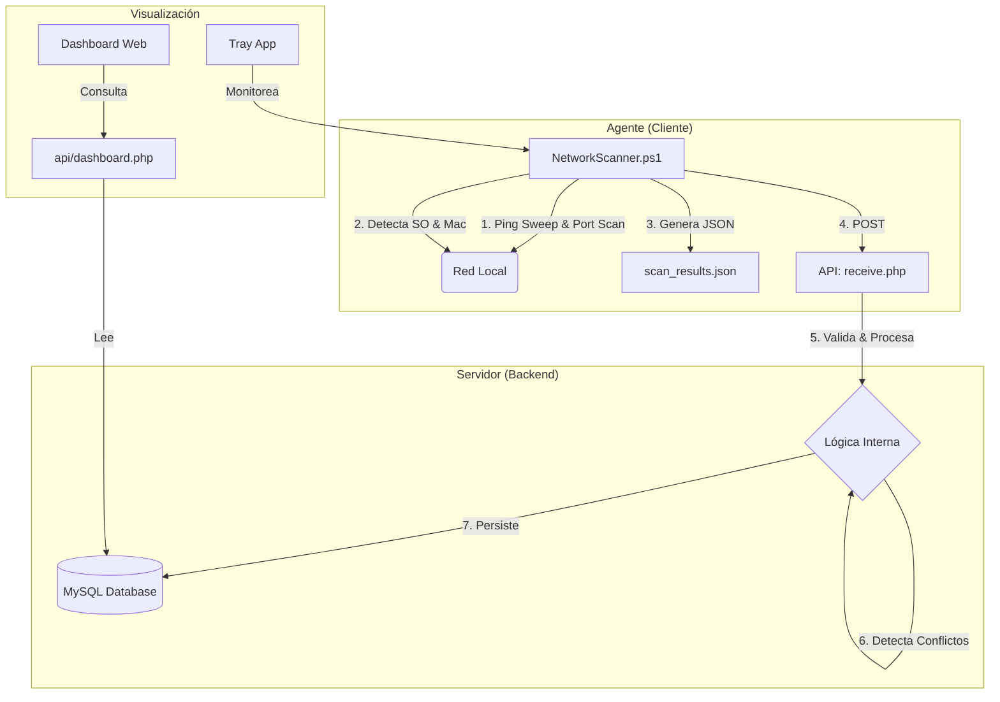

# Escáner de Red y Monitor de Conflictos

Sistema integral de monitoreo de red que combina un potente agente de escaneo en PowerShell con un backend en **PHP** para detectar dispositivos, identificar fabricantes y alertar sobre conflictos de IP/MAC en tiempo real.

### 🖥️ Aplicación de Bandeja (System Tray)

La solución incluye una aplicación gráfica (`NetworkScannerUI`) que se ejecuta en la bandeja del sistema para monitorear el servicio.

**Características:**
- Icono en el área de notificaciones
- Menú contextual para Iniciar/Detener el servicio
- Acceso rápido a los Logs
- Indicador visual de estado

**Instalación (Auto-arranque):**
Para que la UI inicie automáticamente con Windows:
1. Copia el ejecutable `NetworkScannerUI.exe` a una ruta permanente.
2. Crea un acceso directo en `shell:startup` O agrega una clave de registro en:
   `HKCU\Software\Microsoft\Windows\CurrentVersion\Run`
   Nombre: `NetworkScannerUI`
   Valor: `"C:\Ruta\A\NetworkScannerUI.exe"`

## 🚀 Características Principales

*   **Escaneo Inteligente**: Agente PowerShell optimizado con ejecución en paralelo y caché de puertos.
*   **Detección Híbrida**: Identificación de Sistema Operativo mediante WMI (Windows Domain) y análisis de TTL.
*   **Backend PHP Eficiente**: Procesamiento asíncrono mediante scripts programados (Cron/Task Scheduler) o API REST.
*   **Validación de Conflictos**: Detecta automáticamente:
    *   **IP Duplicada**: Misma IP en diferentes Hostnames/MACs.
    *   **MAC Duplicada**: Misma MAC en diferentes Hostnames.
*   **Base de Datos de Fabricantes**: Identificación automática usando seeders locales (OUI IEEE).

## 🏗️ Arquitectura y Flujo de Datos

El sistema funciona desacoplando el escaneo (Agente) del procesamiento (Servidor).



1.  **Agente**: Ejecuta el escaneo y envía los resultados directamente vía API REST.
2.  **Servidor**: El endpoint `receive.php` procesa los datos en tiempo real, detectando cambios y conflictos antes de guardarlos.

## 📚 Documentación Completa

Para detalles profundos sobre el funcionamiento y uso del sistema, consulta nuestros manuales:

*   📘 **[Manual de Usuario](docs/manual_usuario.md)**: Guía para entender el Dashboard, la aplicación de bandeja y solución de problemas básicos.
*   ⚙️ **[Manual Técnico](docs/manual_tecnico.md)**: Documentación para desarrolladores. Incluye diagrama **ER de Base de Datos**, referencia de **API**, y explicación detallada de los scripts.

## 🛠️ Requisitos del Sistema

*   **Agente**:
    *   Windows con PowerShell 5.1+ (Recomendado PowerShell 7+ para paralelismo).
    *   (Opcional) Linux con PowerShell Core instalado.
*   **Backend (Servidor)**:
    *   PHP 7.4 o superior.
    *   Extensiones PHP: `php-pdo`, `php-mysql`, `php-json`.
*   **Base de Datos**:
    *   MySQL 8.0 o MariaDB equivalente.
    *   **Node.js & NPM** (Para inicialización y seeders).

## 📦 Guía de Instalación y Configuración

### 1. Configuración de Base de Datos

El proyecto incluye herramientas automatizadas en Node.js para la creación del esquema y la carga de datos (OUI, Puertos, etc.).

1.  **Configurar Variables de Entorno (.env)**:
    En la raíz del proyecto, crea un archivo `.env` basado en el siguiente ejemplo:
    ```ini
    # .env
    DB_HOST=localhost
    DB_PORT=3306
    DB_USER=tu_usuario
    DB_PASSWORD=tu_contraseña
    DB_NAME=escaner_red
    ```

2.  **Inicializar Base de Datos (Node.js)**:
    Navega a la carpeta `database` e instala las dependencias:
    
    ```bash
    cd database
    npm install
    ```

    Ejecuta el script maestro de inicialización:
    ```bash
    npm run db:full-init
    ```
    
    *Este comando ejecutará las migraciones (`migrations/*.sql`) y descargará/cargará los seeders actualizados (`fabricantes`, `protocolos`).*

### 2. Configuración del Servidor (Backend)

El sistema utiliza una **API REST** para la ingesta de datos.

1.  **Servidor Web**: Configura tu servidor (Apache/Nginx/IIS) para servir la carpeta del proyecto.
2.  **Ruta de API**: El agente debe apuntar a `.../server/api/receive.php`.
    *   *Nota*: Asegúrate que este archivo sea accesible desde la red.

### 3. Ejecución del Agente

El `NetworkScanner.ps1` debe configurarse con la URL de tu servidor.

## 📂 Archivos Clave para el Funcionamiento

*   **`.env`**: Archivo de configuración maestro. Aquí se definen las credenciales de la BD.
*   **`server/api/receive.php`**: Endpoint principal de la API. Ingesta datos del agente y maneja la lógica de negocio.
*   **`server/webroot/api/dashboard.php`**: API de lectura para el Dashboard.
*   **`agent/NetworkScanner.ps1`**: Script del agente PowerShell.

## 🚨 Solución de Problemas Comunes

*   **Agente muestra error de conexión API**:
    *   Verifica que la URL en `agent/config.ps1` sea correcta y accesible. Puedes probar abriéndola en el navegador (debería decir "Método no permitido" o "API Online" si es GET).
    *   Revisa el firewall del servidor.
*   **Error "Connection refused" en BD**:
    *   Revisa `DB_HOST` en `.env`. Si usas Docker o WSL, `localhost` podría no ser correcto (prueba `127.0.0.1` o la IP del host).
*   **Powershell Script Execution Disabled**:
    *   Ejecuta `Set-ExecutionPolicy RemoteSigned -Scope CurrentUser` en Windows.

## 📄 Licencia
Distribuido bajo licencia MIT.
