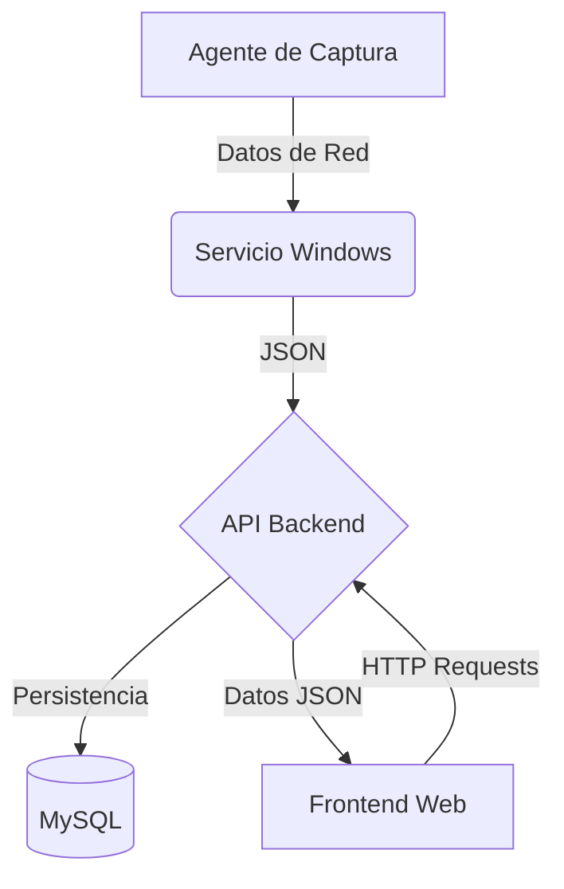

# Monitor de Actividad de Protocolos de Red

## Descripción General

El **Monitor de Actividad de Protocolos de Red** es un sistema integral diseñado para la supervisión en tiempo real del tráfico y los dispositivos dentro de una red local. Su objetivo principal es identificar conflictos de direcciones IP/MAC, detectar protocolos activos y proporcionar una visión clara de la seguridad y el estado de la red.

Este proyecto resuelve la necesidad de administradores de red de tener un control centralizado y visual sobre qué equipos están conectados y qué protocolos están utilizando, permitiendo una respuesta rápida ante anomalías o configuraciones inseguras.

## Características Principales (Features)

*   **Identificación de Dispositivos**: Captura detallada de hostname, dirección IP, dirección MAC, sistema operativo y fabricante del hardware.
*   **Análisis de Protocolos**: Detección y clasificación de los protocolos de red utilizados por cada equipo.
*   **Validación de Seguridad**: Verificación de conflictos IP/MAC contra hostname para detectar suplantaciones o errores de configuración.
*   **Persistencia de Datos**: Registro histórico de actividades y dispositivos en base de datos MySQL.
*   **API REST**: Backend robusto para la gestión de datos y comunicación entre componentes.
*   **Servicio de Windows**: Ejecución en segundo plano con inicio automático al arrancar el sistema.
*   **Agente de Captura**: Módulo ligero conectado al servicio para la recolección de paquetes.
*   **Dashboard Web**: Interfaz de usuario responsiva y moderna para la visualización de datos.
*   **Visualización Intuitiva**: Clasificación de protocolos por colores para una rápida identificación.
*   **Sistema de Reportes**: Generación de gráficos estadísticos sobre el uso de la red.
*   **Exportación de Datos**: Capacidad de exportar reportes en formatos PDF y CSV.

## Arquitectura del Sistema

El sistema sigue una arquitectura distribuida donde los agentes recolectan información y la envían a un servidor central para su procesamiento y visualización.



*Representación simplificada:*
`Agente de Captura` → `Servicio Windows` → `API Backend` → `MySQL`
                                             ↓
                                         `Frontend Web`

## Tecnologías Utilizadas

*   **Servicio y Agente**: C# (.NET)
*   **Backend API**: Node.js / Python / C# (Configurable según implementación)
*   **Base de Datos**: MySQL
*   **Frontend**: HTML5, CSS3, JavaScript (React o Vanilla JS)
*   **Visualización**: Chart.js
*   **Contenedores** (Opcional): Docker

## Instalación

### Prerrequisitos
*   .NET SDK (versión compatible con el servicio)
*   Node.js y npm (si se usa Node para backend/frontend)
*   MySQL Server
*   Git

### 1. Base de Datos
1.  Instale MySQL Server.
2.  Ejecute el script de inicialización ubicado en `/db/schema.sql` para crear la base de datos y las tablas.
    ```sql
    CREATE DATABASE network_monitor;
    USE network_monitor;
    -- (Tablas definidas en schema.sql)
    ```

### 2. Backend API
1.  Navegue al directorio `/backend`.
2.  Instale las dependencias:
    ```bash
    npm install
    ```
3.  Configure las variables de entorno en un archivo `.env` (DB_HOST, DB_USER, etc.).
4.  Inicie el servidor:
    ```bash
    npm start
    ```

### 3. Servicio Windows y Agente
1.  Abra la solución en Visual Studio o use CLI en `/windows_service`.
2.  Compile el proyecto:
    ```bash
    dotnet build --configuration Release
    ```
3.  Instale el servicio (requiere permisos de administrador):
    ```bash
    sc create "NetworkMonitorService" binPath= "RUTA_ABSOLUTA\NetworkMonitorService.exe"
    ```
4.  Inicie el servicio:
    ```bash
    sc start "NetworkMonitorService"
    ```

### 4. Frontend Web
1.  Navegue al directorio `/frontend`.
2.  Instale dependencias (si aplica):
    ```bash
    npm install
    ```
3.  Inicie el servidor de desarrollo:
    ```bash
    npm run dev
    ```

## Uso del Proyecto

1.  **Iniciar Infraestructura**: Asegúrese de que MySQL y el Backend API estén corriendo.
2.  **Activar Agentes**: Inicie el Servicio de Windows en los equipos que desea monitorear.
3.  **Acceder al Dashboard**: Abra su navegador y vaya a `http://localhost:3000` (o el puerto configurado).
4.  **Monitoreo**:
    *   En el **Dashboard** verá los equipos conectados en tiempo real.
    *   Navegue a **Reportes** para ver gráficos de protocolos.
    *   Use **Exportar** para descargar logs de actividad.

## Endpoints del Backend (API Reference)

### Capturas
Registra una nueva captura de tráfico o actividad.
*   **URL**: `/capturas`
*   **Método**: `POST`
*   **Body**:
    ```json
    {
      "hostname": "PC-Gerencia",
      "ip": "192.168.1.15",
      "mac": "AA:BB:CC:DD:EE:FF",
      "protocol": "TCP",
      "timestamp": "2023-10-27T10:00:00Z"
    }
    ```

### Equipos
Obtiene la lista de todos los equipos detectados.
*   **URL**: `/equipos`
*   **Método**: `GET`
*   **Respuesta**:
    ```json
    [
      {
        "id": 1,
        "hostname": "PC-01",
        "ip": "192.168.1.10",
        "os": "Windows 10"
      }
    ]
    ```

### Protocolos Seguros
Lista protocolos considerados seguros (ej. HTTPS, SSH).
*   **URL**: `/protocolos/seguros`
*   **Método**: `GET`

### Protocolos Inseguros
Lista protocolos vulnerables o no cifrados (ej. HTTP, Telnet).
*   **URL**: `/protocolos/inseguros`
*   **Método**: `GET`

### Reportes
Obtiene estadísticas para los gráficos.
*   **URL**: `/reportes`
*   **Método**: `GET`
*   **Respuesta**:
    ```json
    {
      "total_traffic": 1024,
      "protocols_breakdown": { "TCP": 80, "UDP": 20 }
    }
    ```

## Estructura del Repositorio

Se recomienda la siguiente organización de carpetas:

```
/
├── backend/          # Código fuente de la API REST
├── frontend/         # Código fuente de la interfaz web
├── agent/            # Código del agente de captura
├── windows_service/  # Código del servicio de Windows
├── db/               # Scripts SQL y migraciones
├── docs/             # Documentación adicional y diagramas
└── tests/            # Tests unitarios y de integración
```

## Roadmap

- [ ] **Fase 1**: Prototipo funcional (Captura básica y Dashboard).
- [ ] **Fase 2**: Implementación de alertas en tiempo real (WebSockets).
- [ ] **Fase 3**: Soporte para múltiples subredes.
- [ ] **Fase 4**: Autenticación de usuarios y roles en el Dashboard.
- [ ] **Fase 5**: Integración con herramientas SIEM.

## Contribución

¡Las contribuciones son bienvenidas! Por favor siga estos pasos:

1.  Haga un Fork del repositorio.
2.  Cree una rama para su feature (`git checkout -b feature/NuevaCaracteristica`).
3.  Haga commit de sus cambios (`git commit -m 'Agrega nueva característica'`).
4.  Haga push a la rama (`git push origin feature/NuevaCaracteristica`).
5.  Abra un Pull Request.

## Autores

*   **Hector Manuel Padilla Osuna** - *Trabajo Inicial* - [HectorPOsuna](https://github.com/HectorPOsuna)
*   **[Otro Desarrollador]** - *Backend*
*   *(Esta sección está abierta para agregar nuevos colaboradores)*

## Licencia

Este proyecto está bajo la Licencia MIT - vea el archivo [LICENSE.md](LICENSE.md) para más detalles.
