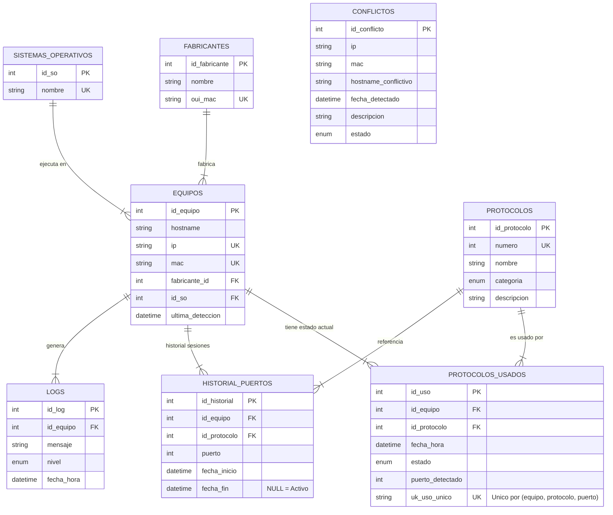

# Documentación del Modelo de Base de Datos

Este documento describe el esquema relacional actual utilizado en el proyecto **Client System Agent**. El modelo ha sido diseñado siguiendo las reglas de normalización (3FN) para garantizar la integridad de los datos, evitar redundancias y mantener un historial auditado de cambios de estado.

## Diagrama Entidad-Relación (ER)

## Descripción de Tablas

### 1. `fabricantes`
Catálogo de fabricantes de hardware de red.
- **Propósito**: Normalizar los nombres de fabricantes asociados a las direcciones MAC.
- **Datos Clave**: `oui_mac` (Identificador único de 6 caracteres hexadecimales).
- **Sembrado**: Se alimenta automáticamente desde la lista oficial IEEE OUI y detecciones del agente.

### 2. `sistemas_operativos`
Catálogo de sistemas operativos detectados.
- **Propósito**: Evitar la repetición de cadenas de texto y agrupar estadísticas (ej. "Windows 11", "Ubuntu 22.04").
- **Datos Clave**: `nombre` (Único).

### 3. `protocolos`
Catálogo maestro de protocolos de red y puertos estándar.
- **Propósito**: Identificar servicios basándose en el número de puerto y clasificarlos por riesgo.
- **Datos Clave**: `numero` (Puerto estándar), `categoria` (seguro, inseguro, precaucion, bases_de_datos, etc.).
- **Sembrado**: Se alimenta desde el registro de IANA y nuevas detecciones.

### 4. `equipos`
Inventario principal "vivo" de dispositivos detectados en la red.
- **Propósito**: Almacenar la última foto conocida de cada dispositivo único.
- **Restricciones**:
    - `ip` y `mac` deben ser únicas.
    - `fabricante_id` es obligatorio (FK).
    - Integridad referencial con `sistemas_operativos`.

### 5. `protocolos_usados`
**Estado Actual** ("Snapshot") de los puertos abiertos en cada equipo.
- **Propósito**: Saber *en este momento* qué puertos están abiertos (activo) o cerrados recientes (inactivo).
- **Clave Única**: `(id_equipo, id_protocolo, puerto_detectado)`. Esto permite al backend hacer "Upserts" eficientes para actualizar el timestamp de detección.
- **Campo `estado`**: `activo` o `inactivo`. Se actualiza dinámicamente según la presencia del puerto en el último escaneo.

### 6. `historial_puertos`
**Bitácora de Sesiones** de uso de puertos.
- **Propósito**: Auditoría forense temporal. Registra *cuándo se abrió* y *cuándo se cerró* un puerto específico.
- **Lógica**:
    - `fecha_inicio`: Timestamp UTC de cuando se detectó el puerto abierto por primera vez.
    - `fecha_fin`: Timestamp UTC de cuando dejó de detectarse. Si es `NULL`, la sesión sigue activa.
- **Utilidad**: Permite responder preguntas como "¿Estuvo el puerto RDP abierto el sábado a las 3 AM?".

### 7. `conflictos`
Registro de anomalías de identidad.
- **Propósito**: Auditar problemas como duplicidad de IPs (IP Conflict) o cambios de MAC (ARP Spoofing/Cambio de Hardware).
- **Estado**: Conflictos pueden marcarse como `detectado` o `resuelto`.

### 8. `logs`
Bitácora de eventos del sistema y la API.
- **Propósito**: Registrar errores de procesamiento, descubrimientos de nuevos dispositivos y actualizaciones críticas.

## Justificación de Relaciones y Reglas

*   **Fabricante -> Equipo (1:N)**: Normalización básica para estadísticas por proveedor.
*   **Equipo -> Protocolos Usados (1:N)**: Relación "viva". Si se borra un equipo, se borra su estado actual (`ON DELETE CASCADE`).
*   **Equipo -> Historial Puertos (1:N)**: Relación histórica. Mantiene el registro de actividad de red a lo largo del tiempo.
*   **Integridad Referencial**:
    - Se utilizan claves foráneas (`FK`) estrictas en casi todas las tablas para garantizar que no existan datos huérfanos.
    - La tabla `conflictos` es una excepción intencional para permitir registrar evidencia sobre IPs o MACs que podrían no ser válidas o consistentes.
