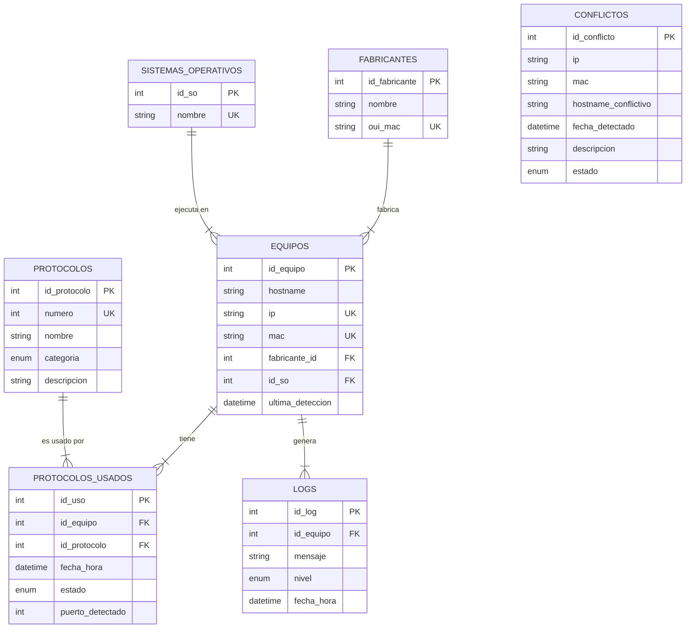

# Documentación del Modelo de Base de Datos

Este documento describe el esquema relacional final utilizado en el proyecto **Escáner de Red**. El modelo ha sido diseñado siguiendo las reglas de normalización (3FN) para garantizar la integridad de los datos y evitar redundancias.

## Diagrama Entidad-Relación (ER)

## Descripción de Tablas

### 1. `fabricantes`
Catálogo de fabricantes de hardware de red.
- **Propósito**: Normalizar los nombres de fabricantes asociados a las direcciones MAC.
- **Datos Clave**: `oui_mac` (Identificador único de 6 caracteres hexadecimales).
- **Sembrado**: Se alimenta automáticamente desde la lista oficial IEEE OUI.

### 2. `sistemas_operativos`
Catálogo de sistemas operativos detectados.
- **Propósito**: Evitar la repetición de cadenas de texto (ej. "Windows 10") en la tabla de equipos.
- **Datos Clave**: `nombre` (Único).

### 3. `protocolos`
Catálogo maestro de protocolos de red y puertos estándar.
- **Propósito**: Identificar servicios basándose en el número de puerto.
- **Datos Clave**: `numero` (Puerto estándar), `categoria` (Clasificación de seguridad: seguro, inseguro, esencial, etc.).
- **Sembrado**: Se alimenta automáticamente desde el registro de IANA.

### 4. `equipos`
Inventario principal de dispositivos detectados en la red.
- **Propósito**: Almacenar el estado actual de cada dispositivo único.
- **Restricciones**:
    - `ip` y `mac` deben ser únicas.
    - `fabricante_id` es obligatorio (se usa un ID por defecto "Desconocido" si es necesario).
    - Integridad referencial con `fabricantes` y `sistemas_operativos`.

### 5. `protocolos_usados`
Registro histórico y activo de servicios detectados en los equipos.
- **Propósito**: Relación N:M entre `equipos` y `protocolos`. Permite saber qué servicios corre cada máquina.
- **Detalle**: Guarda el `puerto_detectado` real, que podría diferir del puerto estándar del protocolo.

### 6. `conflictos`
Registro de anomalías de red.
- **Propósito**: Auditar problemas como duplicidad de IPs, cambios sospechosos de MAC para un mismo Hostname (Spoofing), etc.
- **Independencia**: No tiene claves foráneas estrictas para permitir registrar datos incluso si el equipo no está en el inventario.

### 7. `logs`
Bitácora de eventos del sistema.
- **Propósito**: Registrar acciones del agente, errores o cambios de estado importantes.
- **Relación**: Opcionalmente vinculado a un `id_equipo`.

## Justificación de Relaciones

*   **Fabricante -> Equipo (1:N)**: Un fabricante crea muchos equipos, pero un equipo tiene un solo fabricante (determinado por su MAC). Usamos `ON DELETE RESTRICT` para evitar borrar fabricantes que tienen equipos activos.
*   **SO -> Equipo (1:N)**: Un SO puede estar instalado en muchos equipos. Usamos `ON DELETE SET NULL` para que si se elimina un SO del catálogo, los equipos no se borren, solo queden con SO desconocido.
*   **Equipo -> Protocolos Usados (1:N)**: Un equipo puede tener múltiples puertos abiertos. Usamos `ON DELETE CASCADE` para que si se elimina un equipo, se borre todo su historial de protocolos, manteniendo la limpieza de datos.

## Posibles Extensiones Futuras

1.  **Tabla `vulnerabilidades`**: Relacionar `protocolos` o `sistemas_operativos` con CVEs conocidos.
2.  **Tabla `redes`**: Agrupar `equipos` por subredes o VLANs identificadas.
3.  **Historial de Cambios (`equipos_historico`)**: En lugar de sobrescribir la IP/MAC en `equipos`, mover el registro antiguo a una tabla histórica para auditoría forense.
4.  **Usuarios**: Si se implementa autenticación, relacionar equipos con usuarios responsables.
