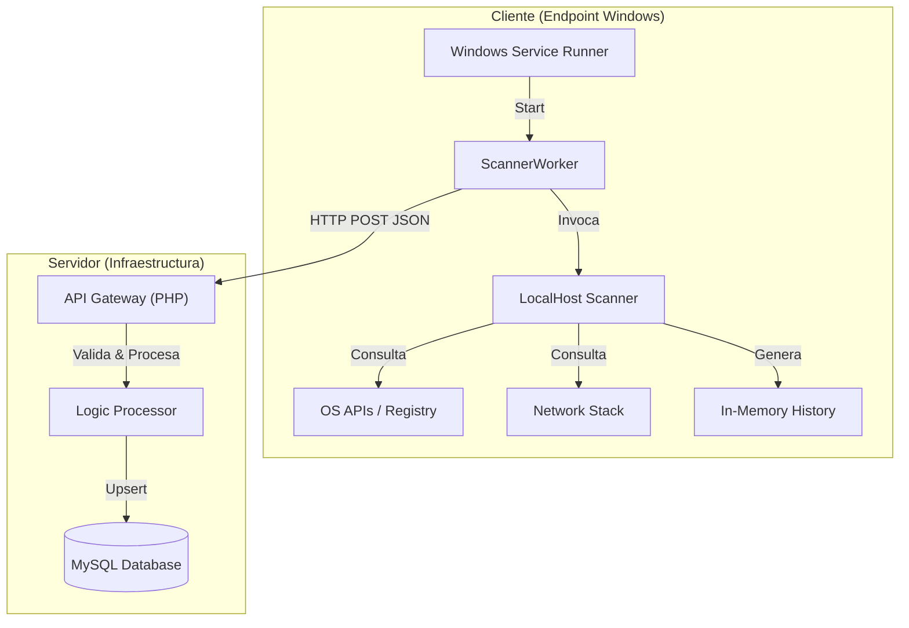
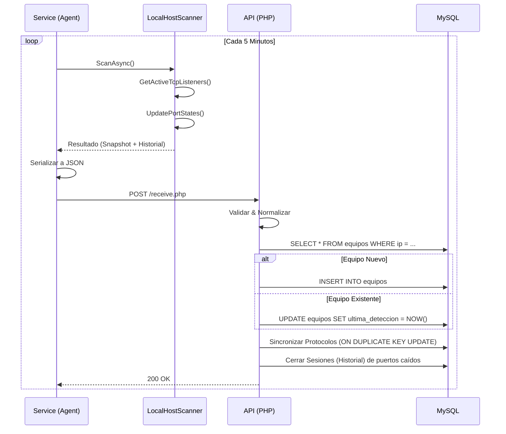

# Manual Técnico - Agente de Monitoreo de Red

**Versión:** 2.0  
**Fecha:** Enero 2026  
**Tecnología:** .NET 8 (Cliente) / PHP & MySQL (Backend)

---

## 1. Introducción Técnica

### 1.1 Problema Identificado
En entornos de red heterogéneos, mantener un inventario actualizado y real de los dispositivos, sus sistemas operativos y los servicios (puertos) expuestos es un desafío crítico. Los escaneos externos a menudo son bloqueados por firewalls locales, y los inventarios manuales quedan obsoletos rápidamente.

### 1.2 Solución Propuesta
El sistema implementa una arquitectura **Cliente-Servidor mediante Agente**. Un servicio de Windows ligero (.NET 8) instalado en cada equipo realiza introspección local ("localhost scan") para recolectar telemetría de red fidedigna y la transmite a una API centralizada.

### 1.3 Alcance
- **Cliente:** Servicio Windows `NetworkScanner.Service` (Self-contained, No requiere instalación previa de .NET Runtime).
- **Servidor:** API REST en PHP hospedada en servidor Linux/Apache.
- **Datos:** Identidad del host, Interfaces de Red, Estado de Puertos (TCP/UDP) y cambios históricos.

---

## 2. Arquitectura del Sistema

El sistema sigue un modelo de **Telemetría Push**. Los agentes son autónomos y envían datos periódicamente.



### 2.1 Justificación Tecnológica
*   **.NET 8 Self-Contained:** Garantiza que el agente funcione en cualquier máquina Windows moderna sin dependencias externas ni instalaciones previas de frameworks, reduciendo la fricción de despliegue.
*   **API REST:** Desacopla la lógica de recolección de la lógica de negocio. Permite que el agente sea "tonto" (solo recolecta) y el servidor "inteligente" (analiza, clasifica y alerta).

---

## 3. Cliente (Module: NetworkScanner.Service)

El núcleo del cliente es un **Windows Service** diseñado para operar en segundo plano (Session 0) sin interacción de usuario.

### 3.1 Ciclo de Vida
1.  **OnStart:** Inicializa el `HostApplicationBuilder`, configura DI (Dependency Injection) y logging.
2.  **Worker Loop (`ScannerWorker.cs`):**
    *   Ejecuta `EjecutarCicloEscaneo()` inmediatamente.
    *   Entra en espera (`Task.Delay`) según `IntervalMinutes` configurado.
    *   Maneja excepciones con un patrón de **Exponential Backoff** y **Circuit Breaker** para evitar saturar la red o logs en caso de fallo.
3.  **OnStop:** Cierre ordenado de hilos y limpieza de recursos.

### 3.2 Módulos Internos
*   **LocalHostScanner:** Clase nativa en C# (reemplazo de scripts PowerShell) que utiliza `System.Net.NetworkInformation`.
*   **Port State Tracker:** Diccionario en memoria que compara el estado actual de puertos con el ciclo anterior para detectar eventos `OPENED` o `CLOSED`.

---

## 4. Escaneo del Host Local

A diferencia de los escáneres de red tradicionales (Nmap) que lanzan paquetes a la red, este agente realiza **introspección del sistema operativo**.

### 4.1 Proceso de Recolección
1.  **Detección de Host:**
    *   **Hostname:** `Dns.GetHostName()`
    *   **Sistema Operativo:** `RuntimeInformation.OSDescription`
    *   **Fabricante:** Lectura directa del Registro de Windows (`HARDWARE\DESCRIPTION\System\BIOS`).
2.  **Detección de Puertos:**
    *   Usa `IPGlobalProperties.GetActiveTcpListeners()` y `GetActiveUdpListeners()`.
    *   **Filtrado:** Ignora puertos efímeros dinámicos (generalmente > 49152) para reducir ruido.
3.  **Gestión de Historial:**
    *   Mantiene un buffer circular (`_globalHistory`) de los últimos 1000 eventos de cambio de estado.
    *   Registra Timestamps en **UTC** para consistencia global.

---

## 5. Protocolo de Comunicación (API)

El agente serializa los datos y los envía vía HTTP POST.

### 5.1 Payload JSON (Estructura de Compatibilidad)
El agente encapsula los datos en un formato `Devices` para compatibilidad con la lógica de procesamiento masivo del backend.

```json
{
  "Devices": [
    {
      "IP": "192.168.1.50",
      "MAC": "AA:BB:CC:DD:EE:FF",
      "Hostname": "DESKTOP-CLIENT-01",
      "OS": "Microsoft Windows 10.0.19045",
      "Manufacturer": "Dell Inc.",
      "OpenPorts": [
        { "port": 80, "protocol": "TCP" },
        { "port": 443, "protocol": "TCP" },
        { "port": 3389, "protocol": "UDP" }
      ]
    }
  ]
}
```

---

## 6. Backend y Lógica de Negocio

El archivo `receive.php` actúa como controlador principal.

### 6.1 Flujo de Procesamiento
1.  **Validación:** Verifica integridad del JSON y formato de direcciones IP/MAC.
2.  **Normalización:** Estandariza MAC addresses y nombres de host.
3.  **Detección de Conflictos:** Compara la IP/MAC entrante con la base de datos para detectar suplantaciones o duplicados.
4.  **Mapeo Inteligente:**
    *   Clasifica el Sistema Operativo basado en puertos abiertos y firmas (TTL, banners) si el agente no lo reporta explícitamente.
5.  **Persistencia (Micro-ORM):**
    *   **Equipos:** *Upsert* (Update or Insert) basado en MAC/IP.
    *   **Protocolos Usados:** Sincroniza el estado `activo`/`inactivo`.
    *   **Historial:** Cierra sesiones abiertas de puertos que ya no se detectan y abre nuevas sesiones para puertos nuevos.

---

## 7. Modelo de Datos (Base de Datos)

El sistema utiliza un esquema relacional normalizado en MySQL.

### 7.1 Tablas Principales
*   **`equipos`**: Inventario central. Claves únicas por IP y MAC.
*   **`protocolos`**: Catálogo maestro de puertos estándar (80=HTTP, etc.) y su clasificación de seguridad (seguro/inseguro).
*   **`protocolos_usados`**: Tabla de estado actual. Relaciona Equipo <-> Protocolo.
    *   *Constraint*: `UNIQUE KEY (id_equipo, id_protocolo, puerto_detectado)` permite actualizaciones atómicas.
*   **`historial_puertos`**: Log de auditoría.
    *   Campos: `fecha_inicio`, `fecha_fin`. Permite reconstruir el estado de la red en cualquier punto del tiempo.

---

## 8. Diagrama de Secuencia



---

## 9. Seguridad

1.  **Alcance Limitado:** El agente NO realiza escaneos de red horizontal (scanning de otros equipos), limitándose estrictamente a `127.0.0.1`. Esto evita activar sistemas IDS/IPS corporativos.
2.  **Ejecución Privilegiada:** Requiere permisos de Administrador local solo para la instalación del servicio; la ejecución posterior es de bajo impacto.
3.  **Validación de Datos:** El backend sanitiza todas las entradas SQL para prevenir inyección.

## 10. Mejoras Futuras Identificadas

*   **Autenticación Mutua (mTLS):** Para asegurar que solo agentes autorizados envíen datos.
*   **Cola de Mensajes:** Implementar RabbitMQ/Kafka antes de la API para soportar miles de agentes concurrentes.
*   **Actualización Remota:** Capacidad del agente de descargar y aplicar parches desde el servidor.
