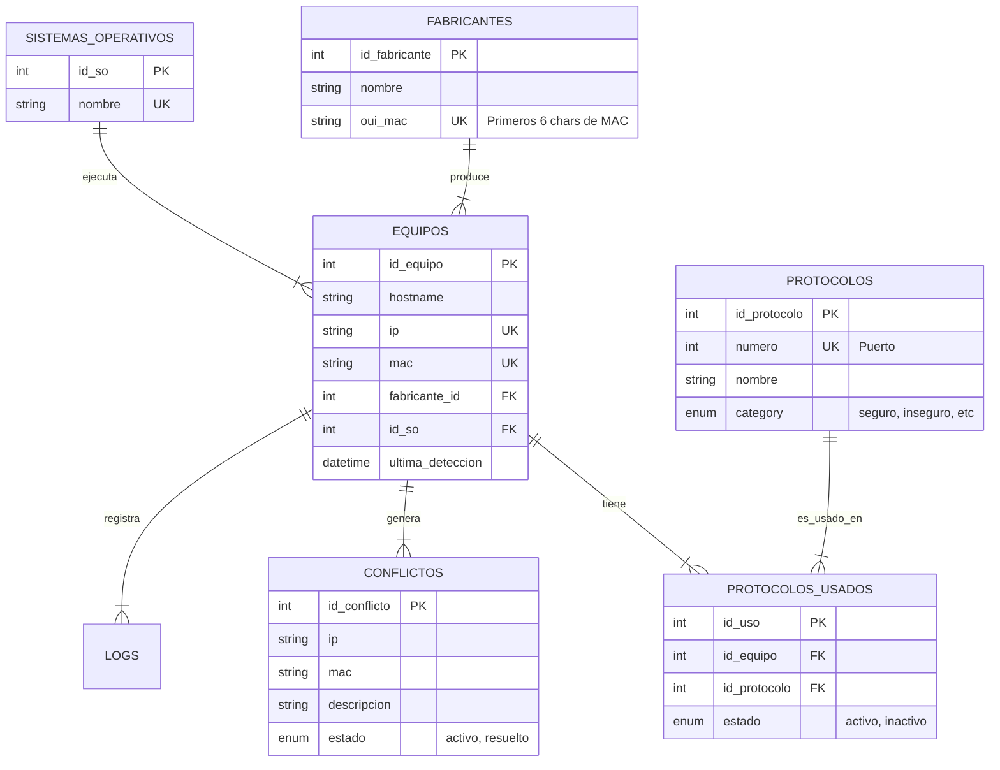

# Manual Técnico - Monitor de Actividad de Protocolos de Red

## 1. Visión General del Sistema

El **Monitor de Actividad de Protocolos de Red** es una solución híbrida diseñada para la detección, inventario y monitoreo de dispositivos en una red local. Su arquitectura se divide en dos componentes principales: un **Agente de Escaneo (PowerShell)** que recolecta datos desde los endpoints, y un **Servidor Central (PHP/MySQL)** que procesa, almacena y visualiza la información, detectando conflictos en tiempo real.

### 1.1 Arquitectura del Sistema

El siguiente diagrama ilustra el flujo de datos desde la recolección hasta la visualización:

```mermaid
graph TD
    subgraph "Agente de Recolección (Cliente)"
        A[NetworkScanner.ps1] -->|Ping Sweep Paralelo| B(Red Local)
        A -->|Escaneo Puertos| B
        A -->|Detección OS (TTL/WMI)| B
        A -->|Genera JSON| C[scan_results.json]
        A -->|POST| D[API: receive.php]
    end

    subgraph "Servidor Central (Backend)"
        D -->|1. Valida Payload| D
        D -->|2. Procesa Lógica| E{Lógica Interna}
        E -->|3. Detecta| F[Conflictos IP/MAC]
        E -->|4. Persiste| G[(MySQL Database)]
    end

    subgraph "Visualización (Frontend)"
        H[Dashboard Web] -->|Consulta| I[API: dashboard.php]
        I -->|Lee| G
        J[Tray App (C#)] -->|Monitorea| A
    end
```

---

## 2. Componentes del Sistema

### 2.1 Agente de Escaneo (`agent/NetworkScanner.ps1`)

El corazón de la recolección de datos. Es un script de PowerShell optimizado para ejecutarse en segundo plano.

*   **Fase 1: Ping Sweep Paralelo**: Utiliza Runspaces de .NET para enviar pings ICMP a toda la subred (1-254) simultáneamente.
*   **Fase 2: Escaneo de Puertos**: Para cada host activo, escanea puertos comunes.
    *   *Optimización*: Posee una caché (`port_scan_cache.json`) con TTL de 10 minutos.
*   **Fase 3: Fingerprinting**: Deduce el SO basado en puertos abiertos, TTL y Hostname.

### 2.2 Servidor y API (`server/api/`)

Backend desarrollado en PHP nativo que centraliza la lógica de negocio en un único punto de entrada para escritura.

*   **`api/receive.php`**: El "cerebro" del backend.
    *   **Validación**: Verifica integridad del JSON y formato de IPs/MACs.
    *   **Procesamiento**: Contiene la clase `Processor` embebida que gestiona la transacción DB.
    *   **Detección de Conflictos**: Compara en tiempo real los datos entrantes con el inventario histórico.
*   **`db_config.php`**: Archivo de configuración global de base de datos (compartido con el frontend).

---

## 3. Modelo de Datos (Diagrama ER)

La base de datos está normalizada para mantener la integridad de los inventarios y el historial de eventos.



### 3.1 Diccionario de Datos

**Tabla `equipos`**
| Columna | Tipo | Descripción |
|---------|------|-------------|
| `id_equipo` | INT (PK) | Identificador único. |
| `ip` | VARCHAR(45) | Dirección IP actual (Debe ser única). |
| `mac` | VARCHAR(17) | Dirección física (Debe ser única). |
| `fabricante_id` | INT (FK) | Referencia a tabla `fabricantes`. Determinada por OUI. |

**Tabla `protocolos`**
| Columna | Tipo | Descripción |
|---------|------|-------------|
| `categoria` | ENUM | Clasificación de seguridad: 'seguro', 'inseguro', 'esencial', 'base_de_datos', etc. Usado para colorear el dashboard. |

---

## 4. Referencia de API

### 4.1 Ingesta de Datos
*   **Endpoint**: `/server/api/receive.php`
*   **Método**: `POST`
*   **Cuerpo**: JSON
*   **Formato**:
    ```json
    [
      {
        "IP": "192.168.1.10",
        "MAC": "AA:BB:CC:DD:EE:FF",
        "Hostname": "PC-SALA-1",
        "OS": "Windows 10",
        "OpenPorts": [
          {
            "Port": 80,
            "Service": "HTTP",
            "Category": "inseguro"
          }
        ]
      }
    ]
    ```

### 4.2 Dashboard Data
*   **Endpoint**: `/server/api/dashboard.php`
*   **Método**: `GET`
*   **Respuesta**:
    ```json
    {
      "summary": {
        "total_devices": 15,
        "active_conflicts": 2
      },
      "devices": [...],
      "conflicts": [...]
    }
    ```

## 5. Lógica de Detección de Conflictos

El sistema evalúa cada dispositivo entrante (`D_new`) contra la base de datos (`D_db`):

1.  **Conflicto de IP**: Si existe un `D_db` con la misma IP que `D_new` pero diferente MAC.
    *   *Significado*: Dos dispositivos peleando por la misma dirección IP.
    *   *Acción*: Se registra en tabla `conflictos`.

2.  **Conflicto de MAC**: Si existe un `D_db` con la misma MAC que `D_new` pero diferente IP.
    *   *Nota*: Esto suele ser normal (DHCP cambiando IP), pero el sistema lo registra como evento si ocurre muy frecuentemente o si la IP anterior sigue respondiendo. Actualmente el sistema actualiza la IP si la MAC coincide, pero alerta si hay inestabilidad.

## 6. Seguridad y Permisos

*   **Database**: Se recomienda un usuario de MySQL con permisos limitados (SELECT, INSERT, UPDATE) exclusivamente para el aplicativo.
*   **Agente**: Requiere permisos de Administrador local (o capacidad de raw socket) para ejecutar Pings ICMP de alta velocidad y escaneos SYN (si se configurara). En modo usuario estándar usa `Test-Connection` que es más lento.
